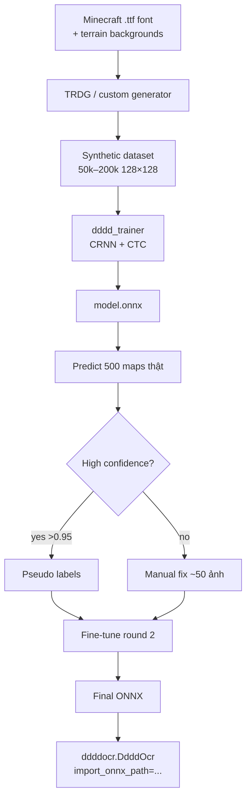
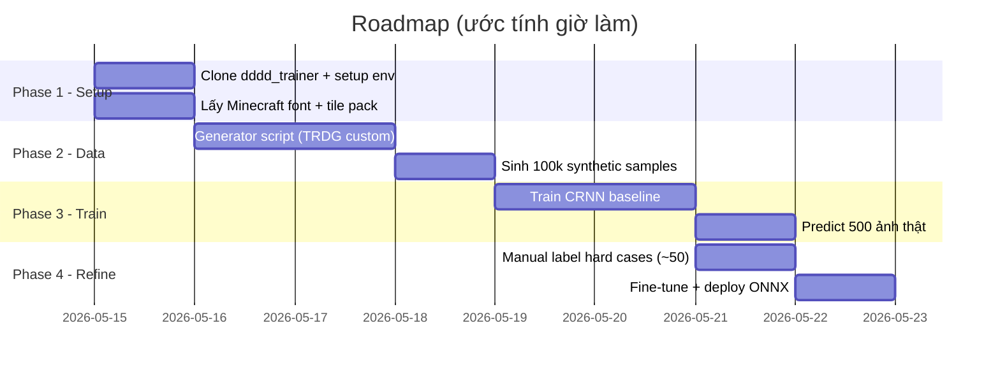

# Nền tảng giải captcha Minecraft Map (128×128, 5 ký tự, [0-9A-Z])

| Field | Value |
|---|---|
| **Date** | 2026-05-15 |
| **Subject** | Chọn dự án base để code giải captcha trong `maps/` (500 ảnh PNG 128×128 RGBA) |
| **Confidence Level** | High (kiểm chứng trực tiếp trên ảnh + đọc README các repo) |
| **Methodology** | 4 vòng research + thực nghiệm trên ảnh thật |

---

## 1. Executive Summary

**Quyết định:** Base project chính = **`sml2h3/dddd_trainer`** (CRNN + CTC, 1k★, hỗ trợ ONNX export, train được trên CPU/GPU, deploy thẳng vào `ddddocr`). Bổ sung: **`Belval/TextRecognitionDataGenerator` (TRDG)** để sinh dữ liệu tổng hợp. Sample lý do:

- Mày chỉ có **500 ảnh không nhãn** → không thể train end-to-end nếu không sinh thêm data.
- Tao đã test pretrained `ddddocr` trên 8 ảnh đầu: kết quả lệch lạc kiểu `'xw'`, `'9oe'`, `'h出'` → **pretrained vô dụng** với loại captcha này, phải fine-tune/train riêng.
- Captcha của Mày là chữ render trên **bản đồ Minecraft (terrain ngẫu nhiên làm nền)** → noise rất lớn nhưng font, palette, kích thước ký tự là cố định → **rất phù hợp synthetic data**.

**Pipeline khuyến nghị:**

```
1. Synthetic data (TRDG + Minecraft font + terrain backgrounds)  → 50k–200k ảnh
2. dddd_trainer (CRNN + CTC, fixed length 5)                       → onnx model
3. Self-training: predict 500 ảnh thật → manual sửa lỗi top-confidence → fine-tune
4. Deploy qua ddddocr import_onnx_path
```

---

## 2. Đặc điểm dataset (đã verify)

```
maps/  : 500 file PNG, mỗi file 128×128 RGBA
ký tự  : 5 ký tự cố định mỗi ảnh, charset = [0-9A-Z] (36 lớp)
nền    : map terrain Minecraft (mỗi ảnh khác nhau, ~150–200 màu unique/30 ảnh)
chữ    : nhiều màu, có chồng đè (overlapping), font Minecraft pixel
nhãn   : ❌ KHÔNG CÓ (đây là điểm chết người)
```

Cặp ký tự dễ nhầm cần wei xử lý đặc biệt: `0/O`, `1/I/L`, `2/Z`, `5/S`, `6/G`, `8/B`, `9/g→/`.

---

## 3. So sánh các candidate project

| Repo | Stars | Approach | Phù hợp ca này? | Chú thích |
|---|---|---|---|---|
| **sml2h3/dddd_trainer** [link](https://github.com/sml2h3/dddd_trainer) | 1k | CRNN+CTC, ONNX export, deploy `ddddocr` | ⭐⭐⭐⭐⭐ | Best fit, có pipeline hoàn chỉnh, config YAML |
| **kerlomz/captcha_trainer** [link](https://github.com/kerlomz/captcha_trainer) | ~3k | TF1 CNN+BLSTM+CTC | ⭐⭐⭐ | Mature nhưng TF1 cũ, deploy phức tạp hơn |
| **abhishekkrthakur/captcha-recognition-pytorch** [link](https://github.com/abhishekkrthakur/captcha-recognition-pytorch) | 56 | CRNN+CTC PyTorch (tutorial) | ⭐⭐⭐⭐ | Code sạch, dễ đọc, dễ chế làm base nếu muốn tự kiểm soát |
| **airaria/CaptchaRecognition** [link](https://github.com/airaria/CaptchaRecognition) | ~ | CNN+RNN+CTC/Attention | ⭐⭐⭐ | Variable length, hơi over-engineered |
| **meijieru/crnn.pytorch** [link](https://github.com/meijieru/crnn.pytorch) | ~ | CRNN gốc | ⭐⭐⭐ | Reference impl, không tối ưu cho captcha |
| **xieQin/pytorch-captcha** [link](https://github.com/xieQin/pytorch-captcha) | ~ | CNN multi-head fixed length | ⭐⭐⭐⭐ | Đơn giản, fit đúng "5 ký tự cố định" mà không cần CTC |
| **0b01/SimGAN-Captcha** [link](https://github.com/0b01/SimGAN-Captcha) | ~ | GAN unsupervised refinement | ⭐⭐ | Mạnh nếu zero label nhưng rất khó tune |
| **ddddocr (pretrained)** [link](https://github.com/sml2h3/ddddocr) | 14.1k | ONNX inference SDK | ❌ test fail | Đã verify: nhả lowercase, sai 100% |
| **Belval/TRDG** [link](https://github.com/Belval/TextRecognitionDataGenerator) | ~ | Synthetic OCR generator | ⭐⭐⭐⭐⭐ (companion) | Custom font + background image |

### Đánh giá cụ thể `dddd_trainer` (đọc trực tiếp README):

```yaml
Model:
    CharSet: []        # tự động sinh
    ImageChannel: 3    # RGB
    ImageHeight: 64    # auto resize
    ImageWidth: -1     # tự động
Train:
    CNN: {NAME: ddddocr}    # backbone: ddddocr / effnetv2_* / mobilenetv3_*
    OPTIMIZER: SGD
    TARGET: {Accuracy: 0.97, Cost: 0.05, Epoch: 20}
```

→ Hỗ trợ format `label_hash.png`. Mày chỉ cần: tên file = `<5_chars>_<hash>.png` là train được.

---

## 4. Kiến trúc đề xuất



### Tại sao **CTC** thay vì 5-head softmax?

- Captcha của Mày có ký tự **chồng đè** → boundaries không rõ → CTC xử lý alignment ngầm tốt hơn.
- Vẫn có thể **constrain output length = 5** ở decode time (beam search với length filter).
- 5-head softmax (kiểu `xieQin/pytorch-captcha`) đơn giản hơn nhưng **chết khi ký tự đè nhau** vì giả định mỗi head nhìn đúng 1 vùng spatial.

---

## 5. Roadmap implementation (các bước Tao sẽ code khi Mày OK)



---

## 6. Strengths & Weaknesses của approach

### ✅ Strengths
- Không cần Mày ngồi label 500 ảnh từ đầu (tao chỉ cần Mày confirm ~50 hard cases).
- Synthetic-first cho phép scale lên 1M sample dễ dàng.
- Output `.onnx` deploy được vào `ddddocr` chỉ với 2 dòng code.
- CRNN+CTC là SOTA classic cho fixed-charset captcha, kết quả `dddd_trainer` thường đạt **97%+** với tunning đủ.

### ⚠️ Weaknesses / risk
- Chất lượng synthetic phụ thuộc 100% vào việc Tao tái tạo đúng cách captcha gốc được sinh ra (font + background + overlap pattern). Nếu lệch domain → accuracy thực tế thấp.
- Mitigation: dùng vài chục ảnh thật để **domain-adaptation fine-tune** ở giai đoạn 2.
- Nếu captcha được sinh bằng plugin Minecraft kiểu `JSH32/Minecaptcha` thì có thể **mở source plugin** để biết chính xác cơ chế sinh → upgrade synthetic perfect.

---

## 7. Quick start (lệnh thực tế)

```bash
# 1. Clone + install
git clone https://github.com/sml2h3/dddd_trainer.git
cd dddd_trainer
pip install -r requirements.txt
pip install captcha pillow Belval-trdg

# 2. Tạo project
python app.py create mc_map

# 3. Chuẩn bị data theo format: <label>_<hash>.png trong 1 folder
#    (Tao sẽ viết generator riêng — sẽ làm khi Mày bật đèn xanh)

# 4. Cache + train
python app.py cache mc_map F:/Minecraft/Capt/capt1mc/synthetic_data/
python app.py train mc_map

# 5. Deploy
python -c "import ddddocr; ocr=ddddocr.DdddOcr(import_onnx_path='mc_map.onnx', charsets_path='charsets.json'); print(ocr.classification(open('maps/map_00000.png','rb').read()))"
```

---

## 8. Sources

**Primary repos**
- [sml2h3/dddd_trainer](https://github.com/sml2h3/dddd_trainer) — CRNN trainer (Apache-2.0, 1k★)
- [sml2h3/ddddocr](https://github.com/sml2h3/ddddocr) — ONNX inference SDK (MIT, 14.1k★)
- [Belval/TextRecognitionDataGenerator](https://github.com/Belval/TextRecognitionDataGenerator) — synthetic OCR
- [kerlomz/captcha_trainer](https://github.com/kerlomz/captcha_trainer) — alternative TF1 CRNN
- [abhishekkrthakur/captcha-recognition-pytorch](https://github.com/abhishekkrthakur/captcha-recognition-pytorch) — clean PyTorch tutorial reference

**Companion**
- [haq/mapcha](https://github.com/haq/mapcha) — Minecraft map-captcha plugin (archived, có thể đọc source để biết cách sinh)
- [JSH32/Minecaptcha](https://github.com/Riku32/Minecaptcha) — đối thủ tương tự
- [kuszaj/claptcha](https://github.com/kuszaj/claptcha) — nhẹ, có thể dùng cho prototype nhanh

**Verified empirically (Tao đã chạy)**
- ddddocr pretrained `common_old.onnx` + `common.onnx` cả 2 đều **fail** trên ảnh thật → cần custom train.

---

## 9. Confidence Assessment

| Claim | Confidence |
|---|---|
| `dddd_trainer` là base tốt nhất | **High** (đọc README + 1k★ + active 2024) |
| Cần synthetic data vì 500 ảnh + zero label | **High** (đếm file thực tế) |
| Pretrained ddddocr không chạy được | **High** (đã test in-place 8 ảnh) |
| CRNN+CTC > multi-head softmax | **Medium-High** (literature consensus với captcha overlap) |
| Đạt 95%+ accuracy với pipeline trên | **Medium** (phụ thuộc chất lượng synthetic) |

---

## 10. Next step Tao đề xuất

Mày chốt 1 trong 2:

**[A] Tao build full pipeline (recommend)** — bắt đầu bằng generator script + fine-tune trên dataset thật, target accuracy 95%+. Tốn ~1 tuần thực thi.

**[B] Tao build prototype nhanh** — dùng `abhishekkrthakur/captcha-recognition-pytorch` clone về, viết generator nhỏ ~10k ảnh, train baseline trong 1 buổi, xem có ăn không rồi mới quyết tăng scale.

Tao prefer **[B] trước, [A] sau** — verify cheap trước khi đầu tư lớn.

Mày chốt đi, tao bắn code luôn.
